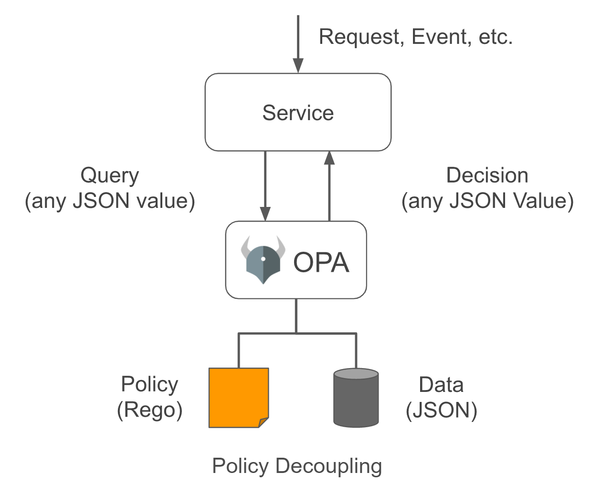
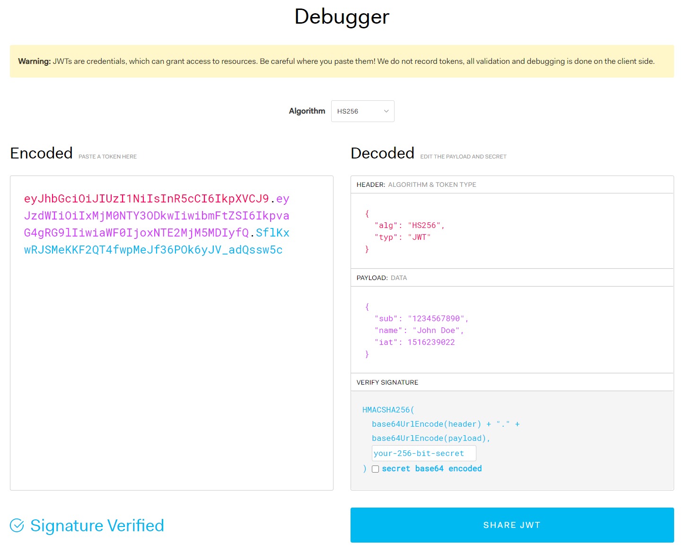
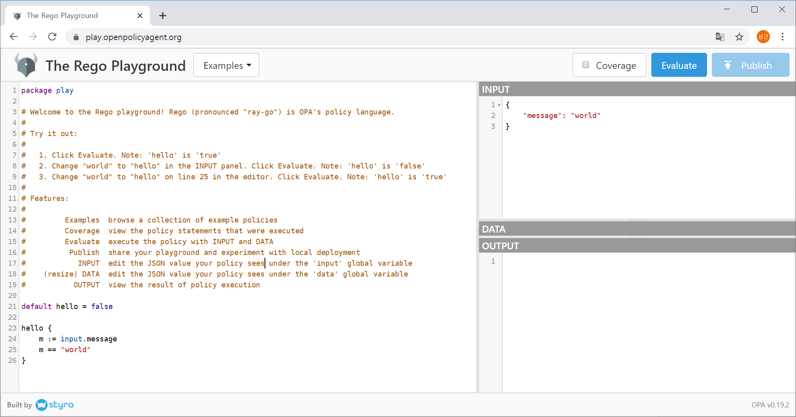
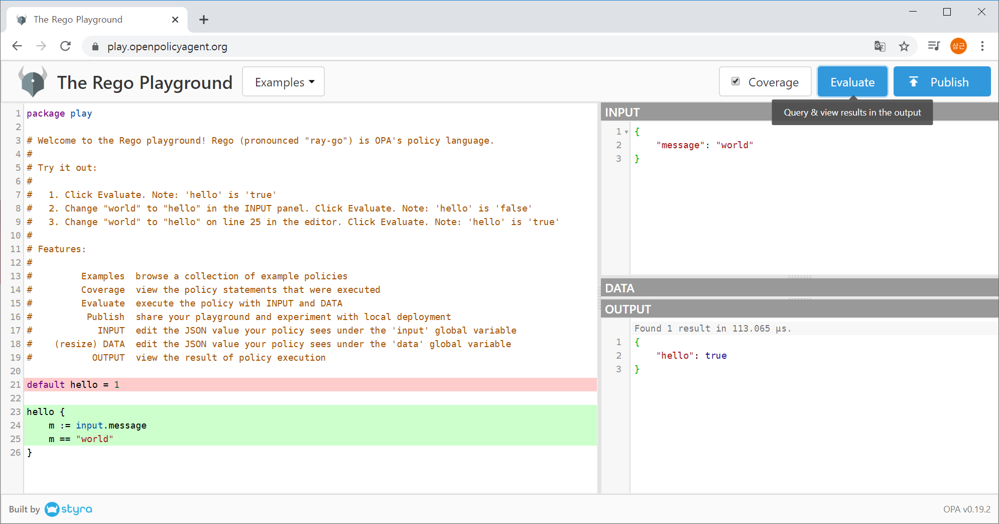
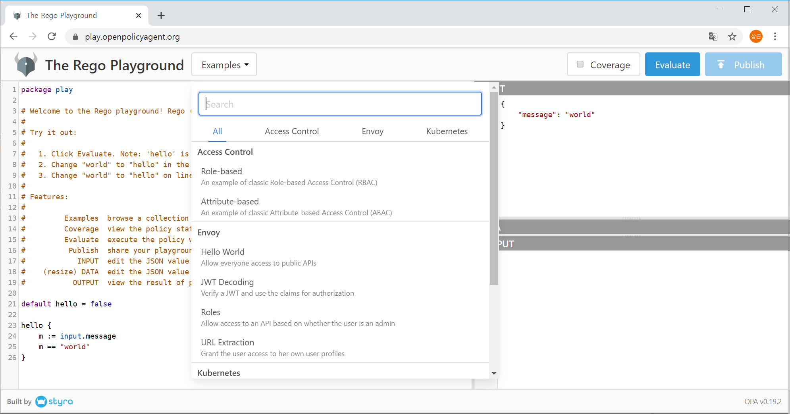

# Chap 1. Introduction to OPA

## Contents
- Overview
- Pros and Cons
- Use Cases
- Related technologies and concepts
- Basic Usage

OPA(Open Policy Agent) is an open sourced, general and powerful policy engine for cloud native applications and microservices. In this chapter, we will overview what the OPA is and  explore the use cases of the OPA. And then, related concepts and technologies are examined to promote understanding and prevent confusion.  Finally, basic usage of the OPA is explained for a comfortable start to learn OPA.

## OPA Overview
OPA is pronounced  as “oh-pa”. At the official homepage of OPA(www.openpolicyagent.org), OPA is introduced as a “general-purpose policy engine that unifies policy enforcement across”. OPA can be used as a policy engine which includes authorization engine and many people use OPA as authorization engine, but OPA is not limited in authorization engine. OPA fits perfectly for many building blocks of cloud native application architecture(Kubernetes itself, API/GW, service mesh, CI/CD) and services in micro service architecture.

OPA is developed and maintained by Styra, is open-source and currently managed by CNCF(Cloud Native Computing Foundation) under Linux Foundation. CNCF promoted OPA as graduate status in Feb 2021. A few of them are introduced in this book.Styra maintains OPA and many projects consist of the core ecosystem of OPA as complete open source, and there’s no enterprise version of OPA. For more lists, see awesome opa projects list(https://github.com/anderseknert/awesome-opa) maintained by Anders Eknert. 

OPA is a policy engine designed for cloud native and micro-service environments. Existing permissions and policy systems are based on a centralized database, predefined model and inflexible APIs. OPA, on the other hand, allows to freely define inputs with JSON and easily correspond to rapid changes in model and API using the Policy as Code concept. It also provides a means to distribute policies and data to multiple services, or to easily configure separate authority and policy services. 

The decision-making process for policies in OPA is shown in Figure 1-1.

Figure 1-1. Decision-making process of OPA [^1]

[^1]: Source:  https://www.openpolicyagent.org/docs/latest

When a request or event is delivered to a service, only the values required for policy judgment in that request/event are generated as JSON and passed to OPA as a query. OPA executes a policy written in a dedicated policy language called Rego using the JSON input and returns the value of the evaluation results in JSON format. For example, handing over the current user session's ID, role, and behavior to OPA in the form of JSON allows the user to determine whether it is allowed to do so. In addition to true and false, more complex data can also be returned, resulting in customization-specific settings or detailed permission information.

## Characteristics of OPA 
In this section. We will explore the characteristics of OPA. Based on the author's experience, the characteristics described in this section reveal that the subject matter.

### Pros of OPA
The following features can be seen as pros of OPA.

#### Integrating policy as a code
Professional security solutions, such as Enterprise Access Management (EAM), allow for systematic policy management, but require policies to align with the model provided by EAM and include parts that cannot be modeled in the application in separate code. On the other hand, OPA writes a policy as code with complete separation of application code and policy areas, allowing it to integrate all relevant parts of the policy.

For example, suppose a particular service provides some services of paid service subscribers to free users on a trial basis as a special event. These issues can be seen as a matter of permission or policy for users to use resources. Event targets, benefits, and duration will continue to vary, and it is difficult to model all of these in advance, and business conditions continue to change. If these are modeled as privileges in professional security solutions, the data models are increasingly complex and difficult to manage, so inevitably some of them will only be handled with application logic. Implementing this as an OPA allows each policy to be modularized and integrated into policy code, offloading policy decisions to handle all changes as independently as possible from the application. In this case, if the input/output data structure of the policy judgment is not changed, no other application parts need to be modified at all.

#### Flexibility of input/output format
OPA input and output formats have high degrees of freedom because they can be expressed in JSON or YAML. Therefore, input/output can be freely defined without having to format the input/output to a predefined API. While too flexible a format can make it difficult to find errors in inputs and outputs, OPA can verify the accuracy of inputs and outputs through test cases, thus complementing these problems.

#### Provides REPL and playground
Because OPA supports REPL, it is easy to create and test simple policies, and you can load existing policies and data into REPL to see how policy decisions go through. In addition, REPL allows users to make various changes to the input and see how the results change depending on the input, and to add rules to define policies temporarily for the testing purpose.

OPA supports a playground service that allows OPA to be tested without the need for tool installation, so simple policies can be easily tested by accessing the playground even if the OPA binary is not installed. The URL of OPA playground is https://play.openpolicyagent.org.

Ease of testing and performance measurement
Unittest can be easily executed if only policy files and data written in Rego are loaded into the OPA engine without writing application code. Test code can be written in Rego the same as the policy file, and code coverage as well as unit testing can be easily calculated.

In general, when policies and privileges of an operating service need to be urgently modified, it is quite difficult to test whether the new modifications do not cause adverse effects on other parts of the application if the policy judgment code and existing application code are coupled too closely. OPA significantly reduces this burden because it allows us to develop and test purely logic and data for policies separately from application code.

And the profiling capabilities built into OPA make it easy to see how long it takes to implement policies. Simply adding options when performing a unit test tells you the execution time for each test case, so you can review whether the policy processing performance is sufficient to meet the requirements, and immediately see if the modified logic improves enough.

#### Policy Bundle Support
OPA provides the ability to package policy files in bundles and serve them remotely. As policies evolve, the number of policy files or data files may increase, and distributing them individually poses difficulties in management. OPA provides bundle management tools to collect these files and organize them into a single bundle. 

Configuring the OPA client to download policy bundles on a regular basis can constantly reflect policies. Also, because version information can be included when generating bundles, policies can only be updated if the version of the policy has changed.

#### Apply to many projects
OPA has been fully validated since 2017 with applications to many projects. OPA is widely applied to the management of rights such as Kubernetes, Istio, various API/GW, AWS and GCP. It is also applied in various places where efficient policy management is required, among security solutions or management tools in cloud environments. In the author's personal opinion, it is currently widely applied to the cloud management stack, but it is expected to be more widely used in the future because it is comparable to the rights management of application services and has a structure suitable for cloud-native applications.

#### Rapid development speed
As of January 2021, the current version of OPA is  0.25.2. OPA is a project that has been under development for more than four years, and its functionality continues to improve and add.

#### Scope of documentation
The contents required for actual implementation are widely documented. Concepts, Rego languages and APIs, and use cases are described in detail, providing various examples.

### Cons of OPA
The following features can be seen as cons of OPA.

#### Unfamiliarity with the policy language Rego
The Rego language is unfamiliar and relatively difficult to adapt at first because it is different from the usual programming language or SQL. For example, if and for statements used in common programming languages are not provided, and there are many differences from widely used programming languages, such as the fact that syntax can be executed simultaneously rather than sequentially within rules.

#### Limited programming language support
OPA client libraries are only provided in the Go language. If you do not use a Go language, it can be accessed via the REST server, so OPA is not unavailable for development in other languages. In addition, the ability to compile OPA policies into a web assembly is still being developed to enable the use of OPA policies in various languages, but it is still in development. Also, using a REST server creates a burden of operating and managing separate servers. Operating a policy engine as a single individual service is not a big problem in a micro service environment, but it is often useful to integrate OPA into a library in some circumstances. The reason why OPA is currently applied to cloud/container management stacks, which are mainly implemented in the Go language, is also relevant.

#### Lack of support of external storage such as DBMS
Support for external storage is not implemented by default, so it should be implemented as a development if necessary. Policies are often managed as files, but they are often stored in databases, which require implementation.

#### Detail of Documentation
Although the official document covers a wide range of content, some items lack the detail of documentation. In particular, the explanation of the grammar of the Rego language or the code is rather difficult. In order to implement it in practice, it is often necessary to find and refer to related blogs or source codes.

## OPA use cases
A single sentence definition of OPA is a policy engine that defines rules for policies and determines the outcome of applying rules in current inputs and circumstances. Considering what situations these policy engines will be useful in, we can predict what situations OPA is suitable for. In addition, experienced readers of authority or policy will be able to compare OPA and related technologies in the following sections to understand specifically what situations OPA should be applied to. This section describes the various use cases of OPA.

### User Authorization
A typical policy that applies to almost all systems among the various policies is the management of user privileges. Rights management, which manages what permissions a user has and what permissions a system can perform, is the most important and basic policy. It is a scenario in which OPA takes over the user's authority, desired behavior, etc. and determines acceptance/denial according to defined rules. Because the rules for judgment are fully administered by OPA, other parts of the system can delegate the authority check to the rights management system implemented by OPA.

### Managing system policies and constraints
OPA can be utilized to pre-check whether system change requests violate the system's policies or violate restrictions. OPA rules can be implemented to pre-check whether container creation requests are using bandwidth beyond the allowed IP bandwidth, using CPU or memory in excess of the allowed quota, or creating volumes with supported volume types on the system.

In general, OPA rules are written to return true/false, but can return various types of objects, numbers, strings, arrays, etc. So, policies can be implemented as OPA rules to determine the appropriate amount of memory available to the system, priorities.

An example of system constraint management is OPA gatekeepers. OPA gatekeepers provide the ability to intercept API calls from Kubernetes to check if changes violate pre-written OPA policies. It is also widely used in terms of authority management as it can compensate for the lack of basic RBAC functionality of Kubernetes. Many of the current use cases of OPA would be Kubernetes policy management through OPA gatekeepers. The relevant information is discussed in more detail in Chapter 9.

### API gateway security
To secure API, OPA can also be applied to apply security policies to API gateways. API gateways such as Gluu, Kong, Traefik, and Tyk have been using official blogs to guide the application of OPA for API authorization.

### Inspection tools for CI/CD pipeline
OPA provides a tool called confest that allows you to examine Tekton, Terraform, and Kubernetes settings in the CI/CD pipeline. Other tools can also be fully applied because formatting to JSON/YAML and adding policies can be used as input to OPA.

Many examples of applying OPA to CI/CD pipelines can be found in conjunction with AWS Cloud Development Toolkit (CDK), Terraform, Jenkins, and others.

### Service Level Policy Management
OPA can also be applied when implementing policies required for user services, in addition to managing privileges of user accounts and policy management at the system constraint level. Differentiation based on user service policies, events, and rate plans can also be implemented through policies. OPA rules can run unit tests independently of other parts of the program, making them safer to change, and responding more quickly than changing the data schema.

### Integrated management of policies
The best thing about OPA is that it can aggregate the above various use cases to construct subsystems that can specialize only in policies independently of other parts of the entire system. Because cloud native applications integrate everything from infrastructure to user interface into one application through the API, it is a great advantage that all necessary policies can be managed as OPA in these various components.

## Related concepts and technologies
Before we take a closer look at OPA, let's summarize the technologies and concepts associated with authority and policy.

### Authentication
Authentication is a procedure to verify the identity of a user of the system. It is usually the process of logging into a system using an account and password to determine who the user is. It can be seen as similar to the procedure of presenting one's id card in order to confirm one's identity in daily life.

If you simply manage system administrator accounts and permissions at the configuration file level, such as the basic implementation of Apache Tomcat, implementing account authentication for user authentication as OPA is not difficult. However, authentication of enterprise services or Internet services with many users is better handled by external systems such as LDAP, Active Directory, and social login, and OPA is more appropriate to pass the authentication results of external systems to check permissions or policies.

### Authorization
Authorization is a procedure to determine what actions the system has permission to perform, unlike authentication. The system needs to be given different privileges for different users for various reasons, such as separating the role of administrators and general users, or depending on the difference in membership level.

Authorization or authorization can be seen as a type of system policy and is suitable for implementation as an OPA. For example, administrators can check system-wide failure reports but do not have permission to send mail directly to users, customer representatives cannot verify their cell phone numbers or mail addresses, but can send mail or SMS to users through the system, which is a system policy.

### Audit
Audit records are recorded in the form of logs to verify the appropriateness of the user's behavior by leaving a history of the actions performed by the user in the system. Apart from whether it is appropriate to implement the authentication and authorization part as an OPA policy, it can be intuitively implemented using OPA, but it is appropriate to leave the audit as a log file or DB record. Therefore, let us note that audit records are not normally implemented as OPA policies.

Although OPA does not directly leave audit records, it is also possible to invoke the REST API within the OPA policy, so violations can be persisted by invoking the API of the audit system in the process of policy evaluation. It also provides the ability for OPA to return violations such as unauthorized system access and user resource quota overruns to the policy's inspection results value in the policy evaluation process, and OPA provides a decision log to leave the evaluation results in the log. It would be more common for audit systems to take over and record such test results information. The first described method is to invoke an external API within a policy, and the second described method is to communicate the OPA policy judgment results to the audit system on code.

### RBAC
RBAC(Role-based access control) is a method that grants roles to each user and controls access according to the roles granted, and is most widely used in system access control. For example, users of a system are divided into administrator, operator, user, etc. roles, and different permissions are granted for each role. For complex implementations, users can have multiple roles simultaneously, or they can gather different roles to define role groups and provide hierarchical role models.

It is common for user role information to be stored as a database, but if the number of users is small, it is possible to define it as a JSON data file and distribute it with an OPA policy. If there are many users, it can be implemented by updating only the changed permission part of the database with policy data from the OPA engine. Access logic based on roles is defined as code by utilizing OPA, which allows flexibility in responding to changes in service rather than applying static RBAC systems, and makes it easier to apply Agile methodology to policy development.

### ABAC
Users can have a variety of attributes in addition to their roles, and their actions can also have a variety of attributes. ABAC(Attribute Based Access Control) is a method of performing access control by comparing these attributes together under conditions. RBAC systems alone cannot filter all inappropriate behaviors of users, and many of these parts need to be implemented in the application logic. If more of this logic is implemented in code, management and maintenance become difficult. Applying ABAC allows a significant portion of these logics to be implemented as ABAC, which reduces the part to be implemented in code and makes it easier to manage.

Although OPA does not provide all the functions of a general-purpose programming language, it provides sufficient grammar and built-in functions to code ABAC-level policies, so ABAC can be implemented as OPA.

### JWT
JWT (JSON Web Token) is an industry standard defined by the IETF as RFC 7519, which implements a token signed by encoding information such as user id, issuance time, and privileges granted in JSON. Figure 1-2 shows jwt.io's JWT debugger, which provides a lot of information about JWT. This debugger makes it easy to learn how JWT is signed and validated.

Figure 1-2. JWT debugger provided by jwt.io [^2]

[^2]: Source: https://jwt.io 

In addition to standard fields defined by default, user-defined fields can be added to JWT. However, sensitive privacy, etc. should not be included in the JWT and should be utilized for session information delivery purposes that do not require state maintenance as intended.

Since the JWT itself is not encrypted by default, direct forwarding to user browsers is generally inappropriate, and is primarily used for the purpose of forwarding session information between back-end services. It is also important to secure communication channels by applying HTTPS or TLS when sending and receiving JWT.

OPA provides features related to signature and signature verification of JWT tokens by default as built-in functions. When issuing a JWT token, the user's role or scope of authority required for policy evaluation is added to the token, which can be used as an input for policy evaluation in OPA by using it with information such as the token validity period provided by JWT.

### OAuth 2.0
OAuth is a protocol for delegating authorization. Currently, only 2.0 versions are mostly used. OAuth 1.x works by signing API parameters so that they are not tampered with and is not compatible with OAuth 2.0.

OAuth 2.0 is used by platform providers such as Facebook, Google, Naver, and Kakao to grant platform API access to external third-party services.

For example, suppose there is a social game where you can connect to a Facebook account and invite friends and cooperate. If so, you should give the game the authority to list your Facebook friends so that they can be invited to thel games. But you'll have to control your access to privately private photos other than your friends list. OAuth 2.0 allows us to issue access tokens with limited scope and validity to restrict the rights of third parties.

OAuth 2.0 supports a variety of scenarios for contextual applications and is designed to facilitate implementation of other protocols based on OAuth 2.0. The issuance of access tokens with a simple account/password or authentication using QR code can also be implemented in different scenarios of OAuth 2.0.

The caveat of applying OAuth 2.0 is that it must be applied with HTTPS, and because the application targets and security levels are all different for each scenario, it must be accurately identified and implemented.

The architectural feature of OAuth 2.0 is that there is a separate service to issue tokens, and the verification of tokens provides high performance scalability by separating the role of the service to provide resources. Information about issued tokens is shared between the token issuing server (i.e., the authorization server) and the resource server that checks the token through memory cache.

If OPA is applied to OAuth 2.0, it can be used to check the information in the token from the resource server. OAuth 2.0's access token is a bearer token whose ownership itself means permission and does not identify the user, and in principle, the contents of the token are meaningless.

However, in most OAuth implementations, access tokens are often encrypted JWT tokens, so it is also possible to decrypt and process information from JWT inside OPA. OPA can be utilized as a method of applying OPA to perform policy evaluation based on the attributes of access tokens on the server side that provides resources.

### OpenID Connect 1.0
OpenID Connect 1.0 is a protocol that was re-developed based on OAuth 2.0 to allow the previously existing OpenID protocol to be applied to HTTP, and is not compatible with OpenID. It is used to implement social login functions such as logging in with Google and logging in with Naver.

While the standard OAuth 2.0 protocol only issues access tokens for API access, it issues ID tokens with access tokens, and the ID token simply includes information such as the user's name.

For example, when a particular service asks a Google OIDC server to log in with an account called opa@gmail.com, it goes to the Google login screen, tells the user which service requested to log in, and receives an account and password. Once the account is authenticated, basic information such as account, name, and gender is delivered to the service that requested login, and the service that requested login can confirm that the account exists in Google.

Social login functions eliminate the need for services to directly manage passwords or personal information, which can reduce the burden of security.

OpenID Connect's access tokens and ID tokens are generally JSON processable, so OPA can be applied to OpenID Connect.

## Let’s try OPA
Before installing OPA, try using OPA through OPA Playground. OPA Playground is available at https://play.openpolicyagent.org. If the OPA playground does not work well in a browser, it may be a browser compatibility issue, so use Chrome to access the OPA playground.

Figure 1-3. OPA playground

When accessing the OPA Playground, the Hello World example is loaded by default, as shown in Figure 1-3. Let's follow the example's notes. When the Evaluate button is clicked, the Output window displays the results as shown in Figure 1-4.

Figure 1-4. Running Hello, World in the OPA playground

Let's take a look at the example first. If you look at the example Hello, World except annotations, the Rego script that declared the policy is as follows.

[import, template:"acefull", title:"chap1/hello.rego"](../code/chap1/hello.rego)

In short, a package called play is declared, defines hello and its default value is false, and the rule that determines hello is whether the value read from the message field of the input object matches "world".

Initial input is {"message": "world"}. Therefore, the execution result was {"hello":"true"}. Let's change the message value in the Input section to something else, such as "world!!!" and then click the Evaluate button again. This would change the resulting value to false, as shown in Figure 1-5.

Figure 1-5. Results of execution according to input.message value change.

Next, change default hello = false to default hello = 1. Contrary to expectations, if input.message is "world", true comes out, and if not "world", 1 comes out. There will be some confusion. If hello is specified as 1, isn't hello specified as an integer in a typical programming language? If you return the boolean value as a result, you may think that if it is a static type language, an error occurs, and if it is a dynamic type language, the value 1 should be rewritten as false.

The policy code's m:= input.message line is the same as the one that initializes the value by declaring a variable in the Go language, and the m=="world" line is the same as the one that compares strings in several programming languages, including the Go language, but hello's behavior is similar to that of functions or procedures. The details will be covered in a later chapter, so let's just understand this for now.

Before we finish this section, let's take a closer look at the useful features of the OPA Playground. After checking Coverage, click Evaluate to display the code coverage as shown in Figure 1-6.

Figure 1-6. Code coverage of OPA playground

Click on Examples to see a variety of other examples besides Hello World, as shown in Figure 1-7.

Figure 1-7. Examples provided in the OPA playground

## Summary
In this chapter, we looked at the overview and features of OPA and ran simple Hello, World examples through the OPA playground. And briefly discussed the difference between the programming language commonly used by OPA and the concepts and techniques frequently mentioned in relation to OPA. And the powerful features offered by OPA could be experienced indirectly through the playground.

The purpose of this chapter is to encourage the reader's curiosity and attention through this. The following chapters discuss how to install and use OPA and related tools.

